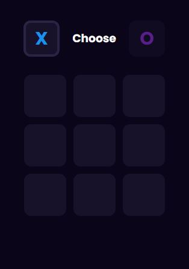

## Crosses of Noliki
Реализация игры "Крестики-Нолики" на HTML, CSS и JavaScript  
  

[GitHub Pages Crosses of Noliki](https://vsamura.github.io/Crosses_of_Noliki/)

***

Сделана для практики по видео с сайта "BK Видео" опобликованное на канале   ["WebTaverna /> js, css, html"](https://vk.com/video-119334888_456244675?t=1s&ref_domain=yastatic.net)  - автору канала и автору видео огромное спасибо!!  
Кроме того, самостоятельно реализована логика игры - логика хода компьютера (app.js - подключён по умолчанию), вместо рандомного хода который сделан на видео (script.js - можно подключить скрипт в файле index.html заменив app.js)  
Если что то идет не так, если появились какие то вопросы, замечания, предложения, идеи или еще что то - я всегда рад диалогу, мои контакты ниже..  

***  

### *Контакты:*  

 

